# 🔥 Langora - Nền Tảng Học Ngoại Ngữ Tích Hợp AI

<div align="center">


**Thành thạo ngôn ngữ Thông minh hơn với AI (Full System)**

[](https://nextjs.org/)
[](https://react.dev/)
[](https://spring.io/projects/spring-boot)
[](https://www.postgresql.org/)
[](https://tailwindcss.com/)

</div>

## 📋 Mục lục

- [Giới thiệu](#-giới-thiệu)
- [Tính năng đã triển khai](#-tính-năng-đã-triển-khai)
- [Công nghệ sử dụng](#-công-nghệ-sử-dụng)
- [Cấu trúc hệ thống](#-cấu-trúc-hệ-thống)
- [Hình ảnh](#-hình-ảnh)

## 🎯 Giới thiệu

Langora là ứng dụng học ngoại ngữ (tiếng Anh, Nhật, Trung) theo phương pháp học tập thông minh. Hệ thống sử dụng Trí Tuệ Nhân Tạo (AI) để hỗ trợ học ngôn ngữ, và một trợ lý ảo Ora AI Chat nhằm giúp người học có trải nghiệm tương tác tốt nhất.

## ✨ Tính năng đã triển khai

### 1. Xác thực & Hồ sơ (Identity & Profile)
- ✅ **Authentication**: Đăng nhập/Đăng ký với JWT (Access/Refresh Token).
- ✅ **Phân quyền**: Hỗ trợ 2 cấp độ (Role-based: Admin & Member) và phân quyền chi tiết (Permissions).
- ✅ **OAuth2**: Đăng nhập nhanh bằng Google OAuth2.
- ✅ **Tài khoản & Hồ sơ**: Quản lý thông tin cá nhân, cài đặt học tập (User Preferences).

### 2. Luyện Viết (Writing Exercises)
- ✅ **Quản lý Bài tập luyện viết**: Hệ thống quản lý bài tập luyện viết, Tích hợp Spring AI và OpenAI, AI chấm điểm, đánh giá ngữ pháp và độ chính xác, phân tích lỗi sai, gợi ý đáp án và các cách diễn đạt khác.

### 3. Trợ lý ảo Ora AI Chat
- ✅ **Giao tiếp Real-time**: Tích hợp Spring AI và OpenAI.
- ✅ **Streaming (SSE)**: Chat trả về theo dạng stream (Server-Sent Events) giúp trải nghiệm người dùng mượt mà, không có độ trễ.
- ✅ **Stateless Chat**: Hệ thống nhận toàn bộ lịch sử tin nhắn từ phía client để đảm bảo tính stateless cho backend.

### 4. Hệ thống Quản trị (Admin)
- ✅ **Dashboard**: Thống kê tổng quan về hệ thống.
- ✅ **Quản lý tài khoản**: Quản lý thông tin tài khoản, phân quyền.
- ✅ **Quản lý học tập**: Quản lý ngôn ngữ, trình độ (Level), chủ đề bài viết, bài tập viết.
- ✅ **Quản lý prompt**: Quản lý Prompt templates.

*(Lưu ý: Các module Từ vựng (Vocabulary) và Thanh toán (Billing) đang trong quá trình phát triển, chưa được triển khai hoàn thiện)*

## 🛠 Công nghệ sử dụng

### ✨ Frontend (Web Client) 
- **Framework:** Next.js 16 (App Router), React 19
- **Ngôn ngữ:** TypeScript
- **State Management:** Zustand (UI State), React Query (Server State/Cache)
- **Styling:** Tailwind CSS v4, Shadcn UI
- **Khác:** Axios, Zod, next-intl (i18n), Server-Sent Events (SSE) cho Ora Chat.

### ✨ Backend (Core API System)
- **Framework:** Spring Boot 3.3.2
- **Ngôn ngữ:** Java 21
- **Database:** PostgreSQL (Spring Data JPA + Hibernate)
- **Security:** Spring Security + OAuth2 Resource Server (Nimbus JOSE + JWT)
- **AI Integration:** Spring AI + OpenAI
- **Khác:** MapStruct, Lombok, Cloudinary (File upload), Swagger (SpringDoc OpenAPI).

## 📁 Cấu trúc hệ thống

Dự án được chia thành hai phần độc lập:

### 1. Frontend (Web Client)

Thiết kế theo kiến trúc Next.js App Router, chia components logic gọn gàng:

```text
langora-web-client/
├── app/                      # Next.js App Router
│   ├── [locale]/             # Thư mục xử lý đa ngôn ngữ (i18n)
│   │   ├── (auth)/           # Luồng xác thực (Login,         Register...)
│   │   └── (app)/            # Luồng ứng dụng chính (Writing, Profile, Dashboard)
├── components/               # React Components tái sử dụng
│   ├── ui/                   # Các core UI components (Button, Input) - Shadcn
│   ├── ora_ai/               # Components liên quan đến AI Chat / Feedback
│   └── profile/              # Components hiển thị hồ sơ
├── services/                 # Lớp giao tiếp API (Auth, Learning, Writing...)
├── stores/                   # Quản lý Global State với Zustand
└── types/                    # Định nghĩa Type/Interface
```

### 2. Backend (Core API System)

Backend được thiết kế theo kiến trúc **Modular Monolith** kết hợp tư tưởng **Clean Architecture**. Hệ thống chia thành các module nghiệp vụ độc lập, giúp dễ dàng mở rộng thành Microservices.

**Các Module (Bounded Contexts) chính:**
- `identity`: Xác thực, phân quyền (JWT, Roles, Permissions).
- `user`: Quản lý hồ sơ, sở thích và mục tiêu học tập.
- `learning`: Cấu trúc bài học (Language -> Path -> Unit -> Lesson).
- `writing`: Quản lý bài tập viết, chấm điểm và AI Feedback.
- `ai`: Quản lý Prompt, API Keys và tích hợp AI.
- `shared`: Các cấu hình dùng chung (ApiResponse, GlobalExceptionHandler, SecurityConfig).

**Cấu trúc chuẩn của hệ thống (Dựa trên cấu trúc thư mục thực tế):**
```text
java/com/langora/<module_name>/
├── controller/     # Lớp REST API đón nhận HTTP Request
│   ├── admin/      # API dành riêng cho quyền Admin
│   └── client/     # API dành cho người dùng cuối (Client)
├── domain/         # Lớp lõi chứa Business Logic
│   ├── entity/     # Các thực thể ánh xạ với Database
│   └── enums/      # Định nghĩa các tập giá trị cố định
├── dto/            # Data Transfer Objects
│   ├── request/    # Dữ liệu đầu vào từ Client
│   └── response/   # Dữ liệu trả về cho Client
├── infrastructure/ # Tương tác Framework, Database và cấu hình
│   ├── config/     # Cấu hình Bean, Security
│   └── mapper/     # Chuyển đổi Entity <-> DTO (MapStruct)
├── repository/     # Giao tiếp Database (Spring Data JPA)
└── service/        # Lớp xử lý logic nghiệp vụ (Business Service)
```

## 🖼 Hình ảnh demo

### 🌍 Web Client (Dành cho Học viên)
#### 1. Trang chủ - Màn hình Đăng nhập / Đăng ký
> Trang chủ hiển thị các thông tin chung của hệ thống, Đăng nhập/Đăng ký bằng Google OAuth2.
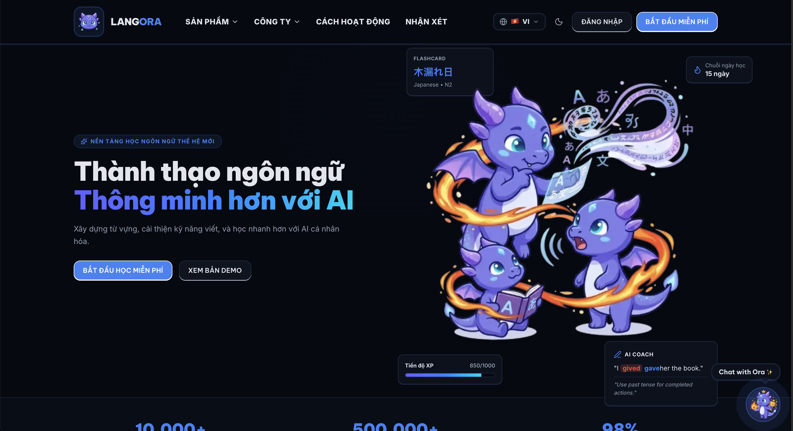


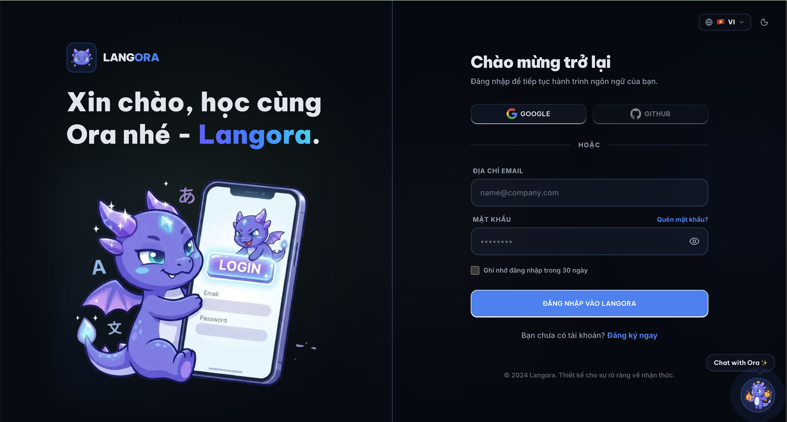


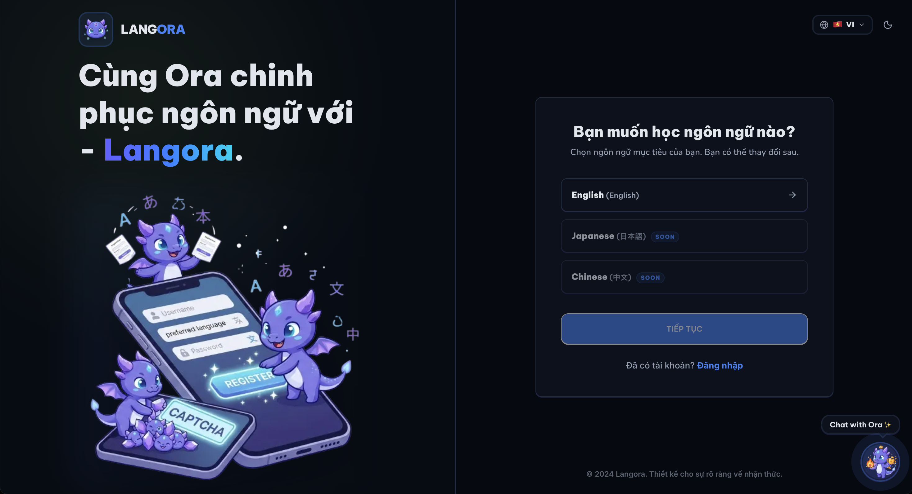

#### 2. Dashboard Member
> Dashboard hiển thị các thông tin tổng quan về hệ thống
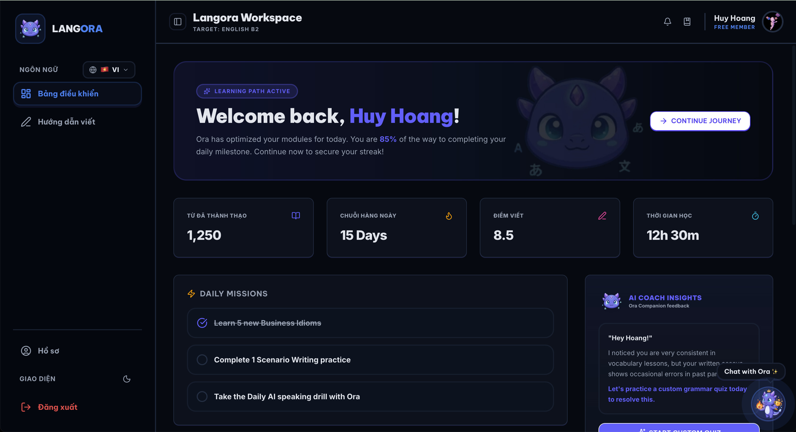

#### 3. Trang hồ sơ (Profile)
> Hệ thống quản lý thông tin cá nhân.
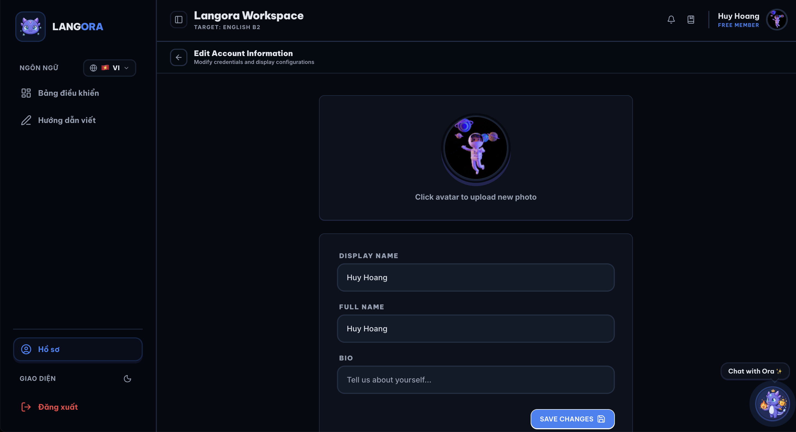

#### 4. Luyện Viết (Writing Exercises)
> Hệ thống quản lý bài tập luyện viết, tích hợp Spring AI và OpenAI, AI chấm điểm, đánh giá ngữ pháp và độ chính xác, phân tích lỗi sai, gợi ý đáp án và các cách diễn đạt khác.
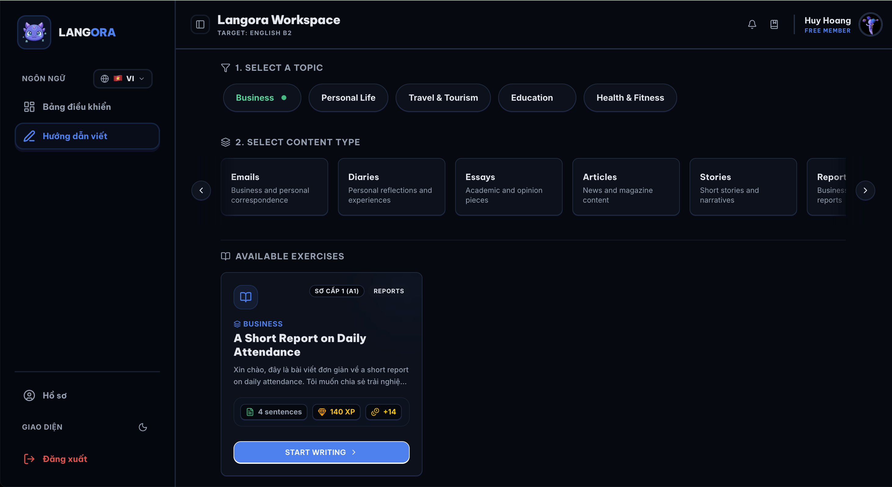


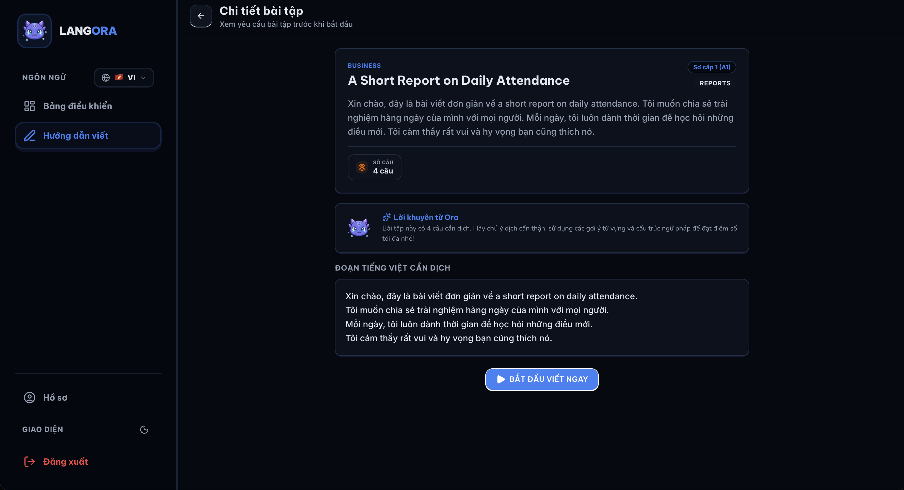


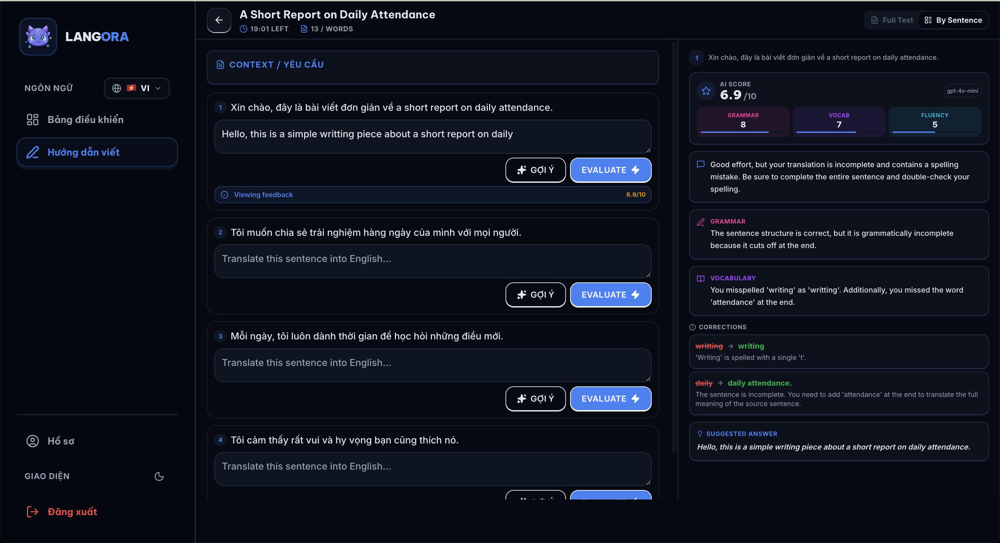

#### 5. Trợ Lý Ảo Ora AI Chat
> Giao tiếp với trợ lý ảo Ora AI Chat.
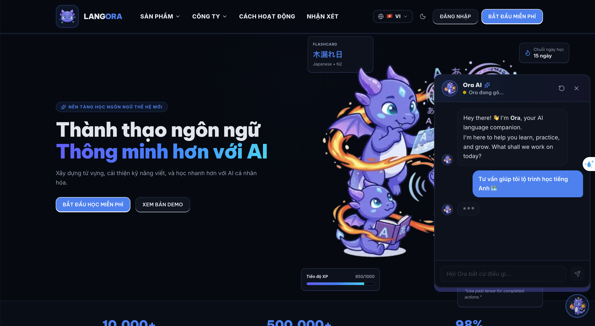

### ⚙️ Admin Portal (Dành cho Quản trị viên)

#### 1. Hình ảnh Admin Portal
> Thống kê tổng quan về hệ thống.
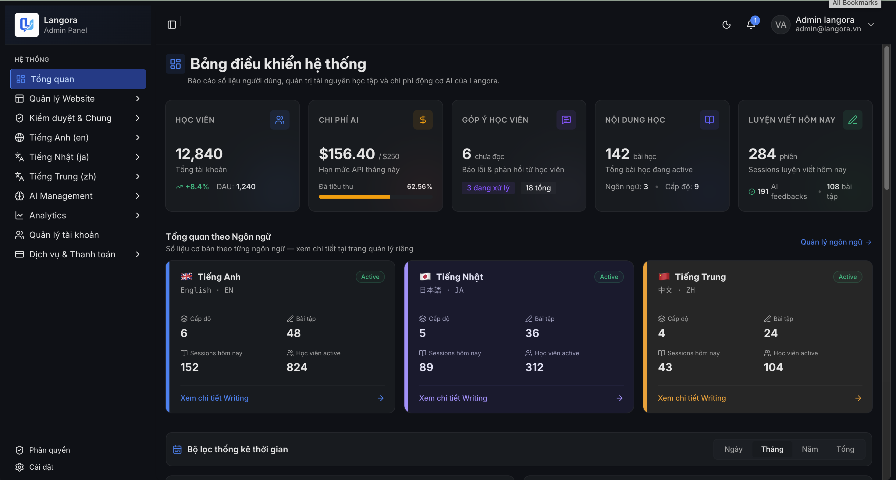

#### 2. Quản Lý Tài Khoản
> Quản lý thông tin tài khoản, phân quyền.
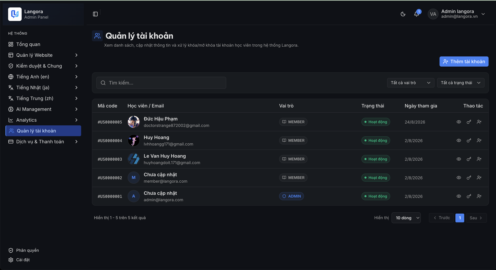

#### 3. Quản Lý Học Tập
> Quản lý ngôn ngữ, trình độ (Level), chủ đề bài viết, bài tập viết.
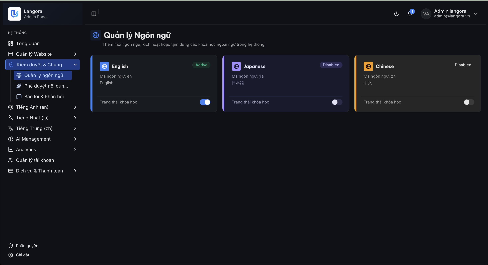


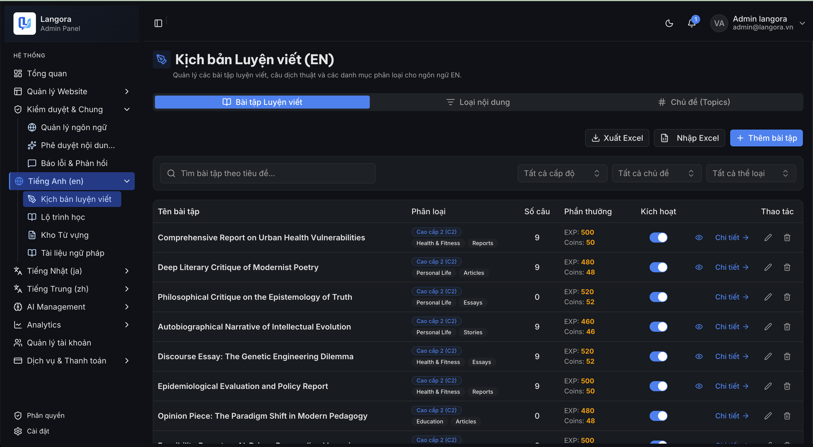


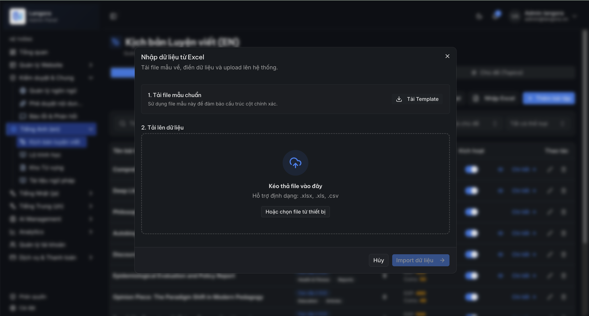

#### 4. Quản Lý Prompt
> Quản lý Prompt templates.
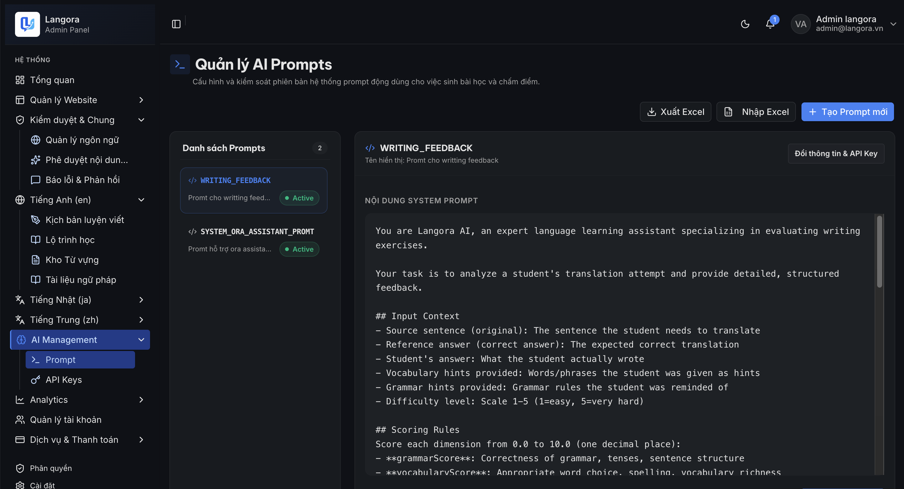

---

<div align="center">

**Nếu bạn quan tâm đến dự án Langora, hãy cho một ⭐ trên GitHub nhé!**

</div>